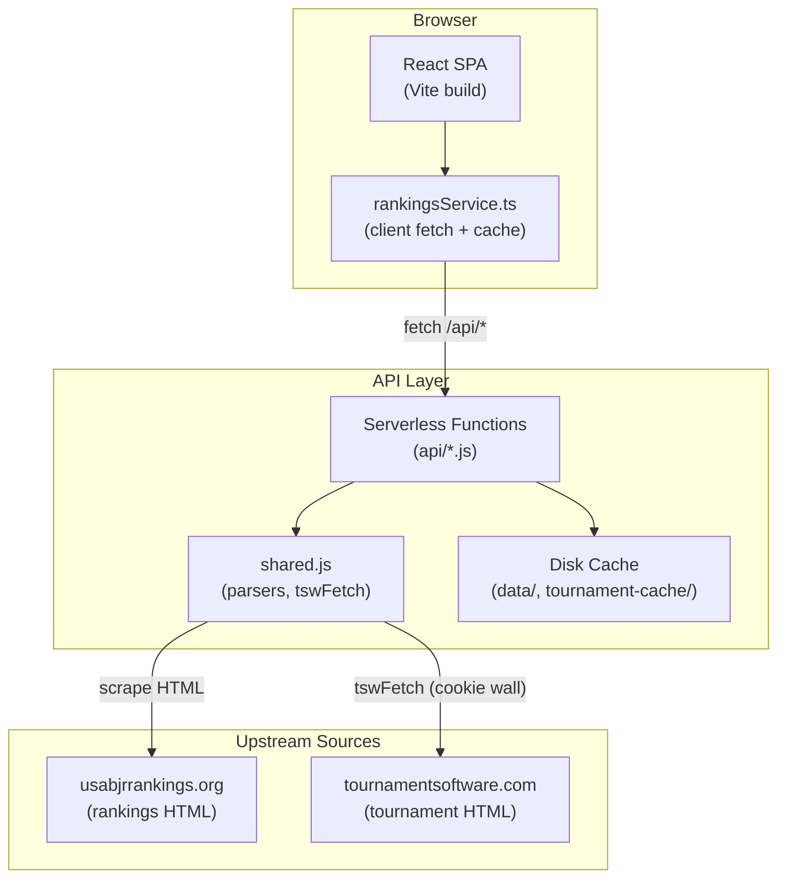
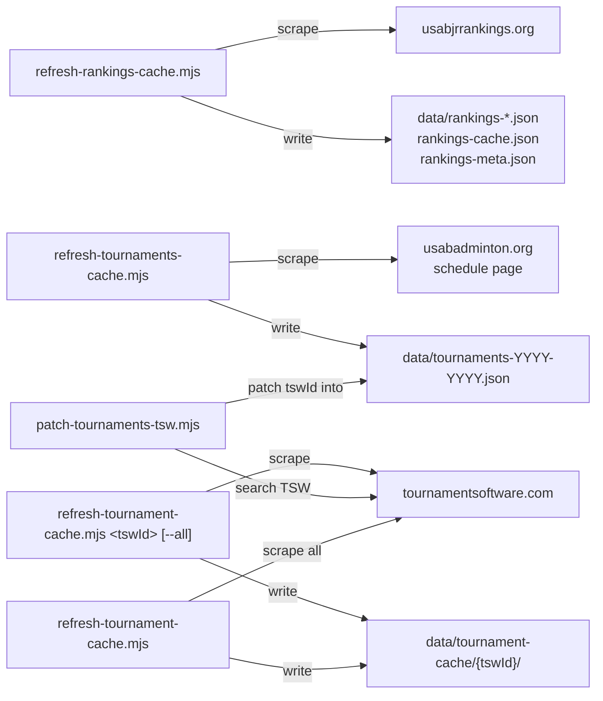
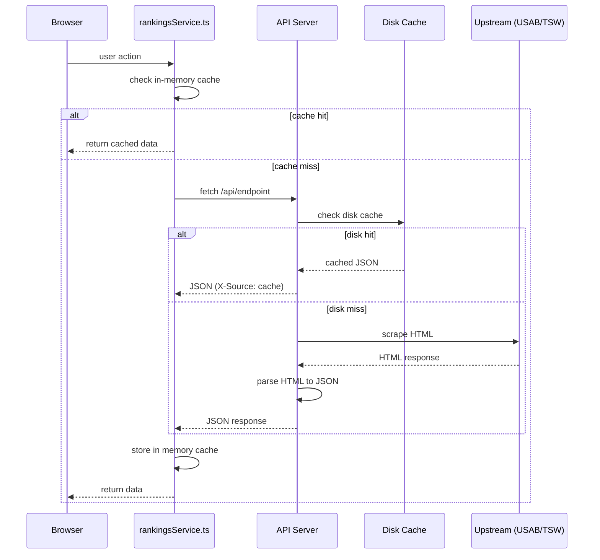

# Architecture Overview

USAB Junior Badminton is a single-page application for exploring USA Badminton junior rankings, player profiles, head-to-head comparisons, and tournament data. It aggregates data from two upstream sources -- the USAB Junior Rankings website and TournamentSoftware.com (TSW) -- and presents it through a React frontend backed by a lightweight Node.js API layer.

## Tech Stack

| Layer | Technology |
|-------|------------|
| Frontend | React 19, TypeScript, Tailwind CSS 4, React Router 7, Recharts |
| Build | Vite 7 with `@tailwindcss/vite` and `@vitejs/plugin-react` |
| API (dev) | Node.js HTTP server (`api-server.mjs` on port 3001) |
| API (prod) | Vercel serverless functions (`api/` directory) |
| Testing | Vitest, Playwright (screenshots) |
| Analytics | Vercel Analytics |
| Hosting | Vercel |

## System Architecture



## Data Flow

There are two primary data pipelines:

### 1. Offline Pipeline (Scripts)

Scripts run manually or via GitHub Actions to scrape upstream sources and persist JSON to disk. These populate `data/` and `tournament-cache/` directories that the API reads from.



### 2. Live Pipeline (API Requests)

When the SPA needs data, `rankingsService.ts` calls `/api/*` endpoints. The API layer first checks disk cache; if missing, it fetches and parses upstream HTML in real time.



## Provider Tree

The app wraps the component tree in nested context providers (`src/App.tsx`):

```
ErrorBoundary
  ThemeProvider            -- dark/light mode (localStorage)
    BrowserRouter
      TournamentFocusProvider  -- tournament focus mode (sessionStorage)
        Navbar + Routes
          PlayersDataLayout      -- wraps player/directory routes with PlayersProvider
          TournamentDetailLayout -- wraps /tournaments/:tswId/* routes with WatchlistProvider
```

- **TournamentFocusProvider** manages a "tournament mode" that locks the Navbar to tournament-specific navigation while the user is exploring a specific tournament.
- **PlayersDataLayout** wraps player/directory routes with `PlayersProvider`, which loads `fetchAllPlayers`, `fetchCachedDates`, and `fetchPlayerDirectory` on mount. Exposes `players`, `directoryPlayers`, `rankingsDate`, `availableDates`, `changeDate()`, and a `playerNameMap` for name lookups.
- **TournamentDetailLayout** wraps `/tournaments/:tswId/*` routes with `WatchlistProvider`. The provider mounts per-tournament and unmounts when leaving, so watchlist state is naturally scoped without manual cleanup.

## Routing

All routes are declared in `src/App.tsx`:

| Path | Component | Purpose |
|------|-----------|---------|
| `/` | `Dashboard` | Home page with feature cards and spotlight tournament |
| `/players` | `Players` (as `Rankings`) | Rankings table, stats, and analytics |
| `/directory` | `AllPlayers` | Player directory (search + browse) |
| `/directory/:id` | `PlayerProfile` | Individual player profile |
| `/head-to-head` | `HeadToHead` | H2H comparison tool |
| `/tournaments` | `Tournaments` | Tournament schedule by season |
| `/tournaments/:tswId` | `TournamentHub` | Tournament hub with section pills |
| `/tournaments/:tswId/matches` | `TournamentMatchesPage` | Match results by day |
| `/tournaments/:tswId/players` | `TournamentPlayersPage` | Player list for a tournament |
| `/tournaments/:tswId/draws` | `TournamentDrawsPage` | Draw list |
| `/tournaments/:tswId/draw/:drawId` | `TournamentDrawDetail` | Bracket or round-robin view |
| `/tournaments/:tswId/events` | `TournamentEventsPage` | Event list |
| `/tournaments/:tswId/event/:eventId` | `TournamentEventDetail` | Event entries and draws |
| `/tournaments/:tswId/seeds` | `TournamentSeedsPage` | Seedings by event |
| `/tournaments/:tswId/winners` | `TournamentWinnersPage` | Results/placements |
| `/tournaments/:tswId/medals` | `TournamentMedalsPage` | Medal tally by club and draw |
| `/tournaments/:tswId/player/:playerId` | `TournamentPlayerDetail` | Player matches within a tournament |
| `/tournaments/:tswId/player/:playerId/schedule` | `PlayerSchedulePage` | Upcoming match schedule with bracket predictions |
| `/tournaments/:tswId/watchlist` | `TournamentWatchlistPage` | Track players and their match results |
| `/players/:id` | redirect to `/directory/:id` | Legacy redirect |
| `/analytics` | redirect to `/players` | Legacy redirect |

## Client-Side Caching

`rankingsService.ts` maintains module-level caches:

- **`Map`-based caches** for tournament details, events, draws, matches, player details, etc. All capped at `MAX_CACHE_SIZE = 200` entries (LRU eviction of oldest key).
- **Singleton caches** for `allPlayers`, `cachedDates`, `directoryPlayers`, and `tournaments` (with TTL of 60s for tournaments).
- **TSW stats and trend caches** are `Map`-based and never invalidated (per-player, loaded on demand).
- **`invalidateRankingsCache()`** resets player data when the rankings date changes.

## Server-Side Architecture

### API Endpoints

The `api/` directory contains Vercel-compatible serverless handlers. In development, `api-server.mjs` serves them via a single HTTP server.

Key server modules:

| Module | Purpose |
|--------|---------|
| `api/_lib/shared.js` (~1886 lines) | TSW cookie wall, `tswFetch`, all HTML parsers (rankings, H2H, draws, matches, players, etc.), in-memory TTL cache |
| `api/_lib/rankingsDiskCache.js` | Read/write `data/rankings-*.json`, `rankings-cache.json`, date listing |
| `api/_lib/http.js` | Error types (`ApiError`, `UpstreamError`), `sendJson`, `sendApiError` |
| `api/tournaments/[tswId]/[action].js` (~1078 lines) | Dynamic tournament router dispatching to `detail`, `draw-bracket`, `matches`, `players`, etc. |

### TSW Cookie Wall

TournamentSoftware.com requires cookie acceptance before serving content. `shared.js` handles this with `ensureTswCookies()` which POSTs to `/cookiewall/Save` and `/sportselection/setsportselection/2`, then includes the resulting cookies on all subsequent requests via `tswFetch()`.

### Tournament Cache (Offline-First)

`api-server.mjs` implements `serveTournamentCache()` which attempts to serve pre-scraped JSON from `data/tournament-cache/{tswId}/` before falling back to live TSW scraping. Responses served from cache include the `X-Source: cache` header, which the client detects reactively (via `useSyncExternalStore`) to hide Refresh buttons for cached tournaments.

## Key Source Files

| File | Lines | Role |
|------|-------|------|
| `src/types/junior.ts` | 543 | Canonical TypeScript types for all domain objects |
| `src/services/rankingsService.ts` | 510 | Client-side fetch functions with LRU caching |
| `src/App.tsx` | 212 | Provider tree, routing, error boundary, analytics |
| `src/contexts/PlayersContext.tsx` | 170 | Global player/rankings state |
| `api/_lib/shared.js` | ~1896 | Server parsers, TSW integration, caching |
| `api/tournaments/[tswId]/[action].js` | ~1077 | Tournament API action router |
| `src/components/tournament/BracketView.tsx` | ~667 | Elimination bracket rendering |
| `src/pages/HeadToHead.tsx` | ~1339 | H2H comparison with merge algorithm |
| `src/pages/PlayerProfile.tsx` | 1373 | Player profile page |
| `src/pages/Players.tsx` | 1068 | Rankings page with analytics |

## Deployment

- **Vercel** hosts the production build.
- `vercel.json` configures:
  - Serverless functions under `api/` with 60s max duration and `data/**` included in the bundle.
  - SPA fallback rewrite: all non-`/api/` and non-`/a/` paths serve `index.html`.
- `vite.config.ts` injects `__VERCEL_GIT_COMMIT_SHA__` and `__BUILD_DATE__` at build time.
- Vercel Analytics script is loaded from `/a/script.js` with route normalization via `ROUTE_PATTERNS`.
