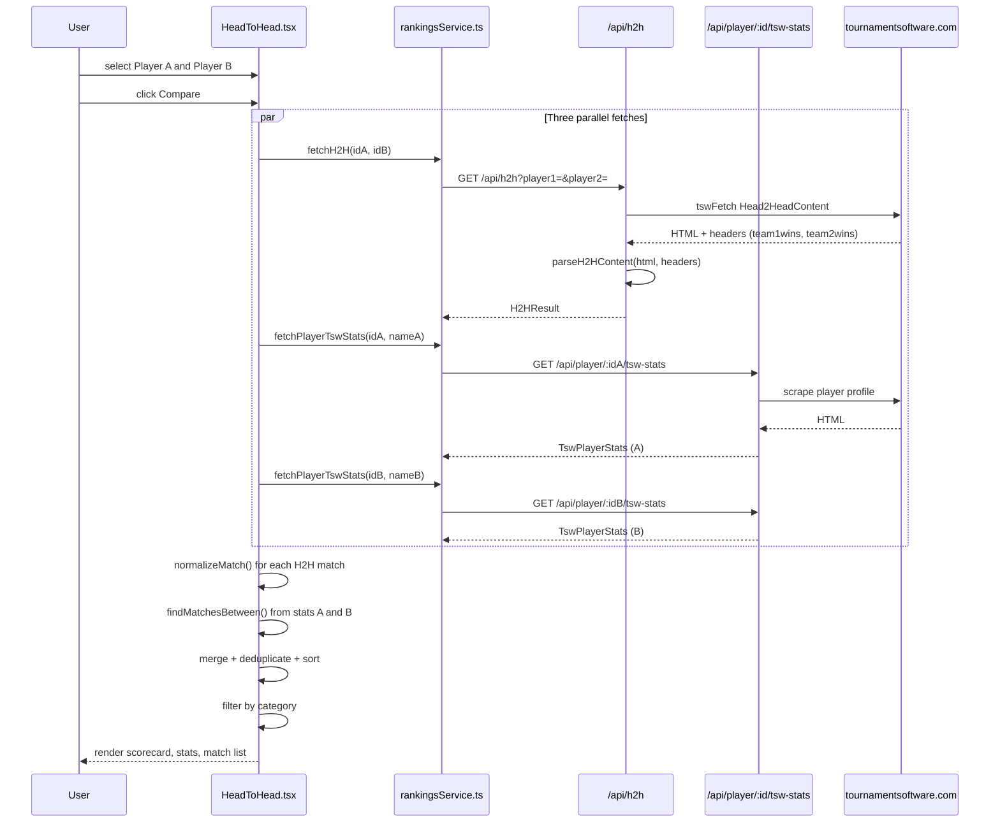

# Head-to-Head (H2H) Page

**Route:** `/head-to-head`
**Component:** `HeadToHead` (`src/pages/HeadToHead.tsx`, ~1330 lines)

## Purpose

The H2H page lets users select two players and see their complete match history against each other, with side-by-side career statistics and ranking comparisons. The system combines data from TSW's built-in H2H feed with supplemental match data from each player's individual TSW profile to produce the most complete record possible.

## Data Flow Overview



## Algorithm: Three Layers

### Layer 1: Server-Side H2H Parsing

**Endpoint:** `GET /api/h2h?player1={usabId1}&player2={usabId2}`
**Server:** `api/h2h.js` -> calls `tswFetch` -> `parseH2HContent(html, headers)` in `api/_lib/shared.js`

The server proxies TSW's H2H feed. The TSW URL is:

```
/head-2-head/Head2HeadContent?OrganizationCode={ORG_CODE}&t1p1memberid={id1}&t2p1memberid={id2}
```

**Parsing `parseH2HContent`:**

1. **Aggregate counts** -- read from HTTP response headers, not computed:
   - `team1wins = parseInt(headers.get('team1wins'))` 
   - `team2wins = parseInt(headers.get('team2wins'))`

2. **Career / This-Year W-L** -- regex-extracted from the HTML table:
   ```
   careerWL: { team1: "12-5 (17)", team2: "5-12 (17)" }
   yearWL:   { team1: "3-1 (4)",   team2: "1-3 (4)"   }
   ```

3. **Match-by-match parsing** -- split HTML on `<div class="match">`, then for each block:
   - **Header:** 3 `<li class="match__header-title-item">` values -> tournament, event, round
   - **Tournament ID:** extracted from `id=UUID` in links or `/tournament/UUID` path
   - **Duration:** from `<time>` element
   - **Teams:** split on `<div class="match__row`; team1 = first row, team2 = second row
   - **Winner detection:** the row containing `has-won` CSS class is the winner
   - **Player names:** `extractPlayers()` pulls names from `nav-link__value` spans, IDs from `data-player-id` or player URL paths
   - **Scores:** each `<ul class="points">` is one game; `<li class="points__cell">` digits build `[a, b]` pairs
   - **Date/Venue:** regexes on `icon-clock` and `icon-marker` sections

**Return type:**

```typescript
interface H2HResult {
  team1wins: number;    // from TSW headers
  team2wins: number;    // from TSW headers
  careerWL: { team1: string; team2: string };
  yearWL: { team1: string; team2: string };
  matches: H2HMatch[];  // parsed match details
}

interface H2HMatch {
  tournament: string;
  tournamentId?: string;
  tournamentUrl: string;
  event: string;
  round: string;
  duration: string;
  team1Players: string[];
  team2Players: string[];
  team1Ids?: (number | null)[];
  team2Ids?: (number | null)[];
  team1Won: boolean;
  team2Won: boolean;
  scores: number[][];
  date: string;
  venue: string;
}
```

### Layer 2: Client-Side Normalization

**Problem:** TSW's "team1" corresponds to whichever `memberid` was passed as `t1p1memberid`, which may not match the user's chosen "Player A". The UI needs Player A consistently on the left.

**Solution: `normalizeMatch(match, playerAName)`**

1. Score each side using `playerMatchScore(playerAName, teamPlayers)`:
   - **3** = exact full-name match (case-insensitive)
   - **2** = one team member's name is a substring of `playerAName` (or vice versa)
   - **1** = same last name only
   - **0** = no match

2. If Player A matches team2 better than team1, **swap**:
   - `team1Players` <-> `team2Players`
   - `team1Ids` <-> `team2Ids`
   - `team1Won` <-> `team2Won`
   - Each score pair `[a, b]` becomes `[b, a]`

3. If both sides score 0, return the match unchanged (edge case: player name doesn't match either side).

### Layer 3: Client-Side Merge

**Problem:** TSW's H2H feed sometimes omits matches (especially walkovers). Each player's individual TSW stats profile may contain matches against the other player that don't appear in the H2H feed.

**Solution: `findMatchesBetween(tswStats, playerAName, playerBName)`**

1. Iterate over all `TswMatchResult` entries from `tswStats.tournamentsByYear`.
2. For each match, check if the opponent matches Player B using `opponentMatches(match, playerBName)`:
   - Split the opponent string on `/` (doubles separator)
   - Check if any part **exactly equals** `playerBName` (case-insensitive, trimmed)
   - This avoids false positives from substring matches (e.g., "Li" matching "Liang")
3. Convert matching `TswMatchResult` entries to `H2HMatch` format via `matchResultToH2HMatch()`, using `parseScoreString()` to convert score strings like `"21-18, 21-15"` into `number[][]`.

**Merge algorithm (`normalizedMatches` useMemo):**

```
1. Start with H2H feed matches, each normalized to Player A's perspective
2. Find supplemental matches from Player A's stats (where opponent = Player B)
3. Find supplemental matches from Player B's stats (where opponent = Player A),
   then normalize those to Player A's perspective
4. Collect dates that already exist in the H2H feed into a Set
5. For each supplemental match:
   - Skip if its date already exists in the H2H set (likely same match)
   - Skip if its event|date key was already added (dedup between A's and B's stats)
   - Otherwise, add to merged list
6. Sort all matches by date descending
```

### Displayed Scorecard

The big win/loss numbers shown on the page are **counted from the merged, normalized, category-filtered match list** -- NOT from TSW's `team1wins`/`team2wins` headers. This means:

```typescript
const filteredWins = {
  team1: filteredMatches.filter(m => m.team1Won).length,
  team2: filteredMatches.filter(m => m.team2Won).length,
  total: filteredMatches.length,
};
```

This can differ from TSW's header totals when:
- Category filters are active (Singles/Doubles/Mixed)
- Supplemental matches from stats were merged in
- TSW's feed included matches outside the current filter

## Player Selection

### PlayerPicker Component

Two searchable dropdown pickers for Player A and Player B. Players are sourced from `PlayersContext`:
- Default list shows `UniquePlayer[]` from current rankings
- Search filters by name (case-insensitive substring)
- Gender filter available (All / Boys / Girls) using `inferGender()` from player entries

### URL State

The selected players are stored in the component's `_h2hSnap` module-level variable for persistence across React Router navigations (not in URL params).

## Category Filtering

Matches can be filtered by event category:

- **All** -- show everything
- **Singles** -- events matching BS/GS or containing "singles"
- **Doubles** -- events matching BD/GD or containing "doubles"
- **Mixed** -- events matching XD or containing "mixed"

Determined by `eventCategory(eventName)` which checks the event string.

## Stats Comparison

Below the scorecard, side-by-side stats from each player's `TswPlayerStats`:
- Career W-L (total, singles, doubles, mixed) with win percentages
- This-year W-L
- These come from the individual profile fetches, independent of the H2H match list

## Rankings Comparison

Expandable `H2HRankingTrendChart` component showing both players' ranking trends over time using `PlayerRankingTrend` data. Dual-axis Recharts LineChart with rank (inverted) and points.

## Match History List

Rendered as `MatchCard` components, each showing:
- Tournament name (linked to app's tournament page if `tournamentId` available)
- Event name and round
- Both teams' player names (linked to tournament player pages when IDs available)
- Score with game-by-game display
- Walkover badge when applicable

## External Link

"View on TSW" button opens the official TSW H2H page:
```
https://www.tournamentsoftware.com/head-2-head?OrganizationCode={ORG_CODE}&T1P1MemberID={id1}&T2P1MemberID={id2}
```
