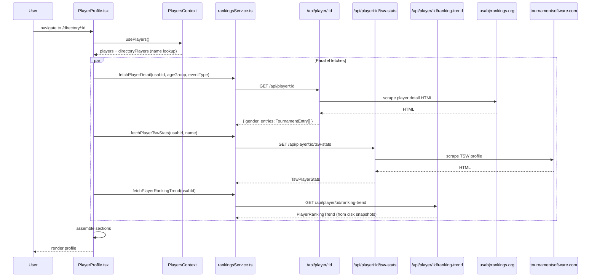
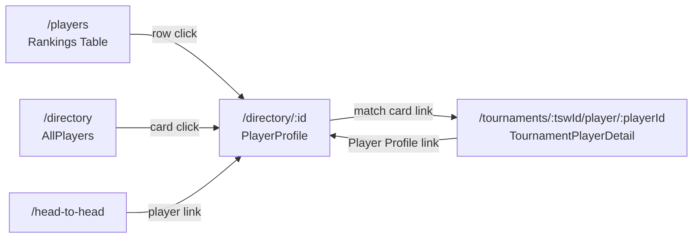

# Player Profile Page

**Route:** `/directory/:id`
**Component:** `PlayerProfile` (`src/pages/PlayerProfile.tsx`, 1373 lines)

## Purpose

The Player Profile page provides a comprehensive view of a single junior badminton player, combining data from USAB rankings and TournamentSoftware.com (TSW). It shows current rankings, historical ranking trends, career match statistics, and a full tournament-by-tournament match history.

## Data Flow



## Data Sources

### 1. Player Identity (from PlayersContext)

The player's name is resolved from either the `players` array (current rankings) or `directoryPlayers` (historical names). The `usabId` from the URL param is the lookup key.

### 2. USAB Player Detail

**Endpoint:** `GET /api/player/:id?age_group=&category=&date=`

The server scrapes `usabjrrankings.org/{usabId}/details` and returns:
- `gender: string | null` -- inferred from the USAB profile page
- `entries: TournamentEntry[]` -- tournament history with name, location, date, points, place, and optional `tournamentId`

### 3. TSW Player Stats

**Endpoint:** `GET /api/player/:id/tsw-stats?name=`

The server searches TSW for the player by name and scrapes their profile to return:
- `tswProfileUrl` / `tswSearchUrl` -- links to TSW
- Win/loss records by category (`total`, `singles`, `doubles`, `mixed`), each with `career` and `thisYear` breakdowns
- `recentHistory` -- array of recent match outcomes (for form/streak display)
- `tournamentsByYear` -- grouped `TswTournament[]` each containing `TswMatchResult[]` with full match details (opponent, partner, score, won/lost, walkover status, player IDs)

### 4. Ranking Trend

**Endpoint:** `GET /api/player/:id/ranking-trend`

Built server-side by scanning all `data/rankings-*.json` snapshots and collecting the player's `PlayerEntry[]` at each date. Returns `RankingTrendPoint[]` for charting.

## Types

```typescript
// Key types from src/types/junior.ts
interface TournamentEntry {
  tournamentName: string;
  location?: string;
  date?: string;
  points: number;
  place?: string;
  tournamentId?: string;
}

interface TswPlayerStats {
  tswProfileUrl: string | null;
  tswSearchUrl: string;
  total: CategoryStats;
  singles: CategoryStats;
  doubles: CategoryStats;
  mixed: CategoryStats;
  recentHistory: Array<{ won: boolean; date: string }>;
  tournamentsByYear: Record<string, TswTournament[]>;
}

interface PlayerRankingTrend {
  usabId: string;
  name: string;
  trend: RankingTrendPoint[];  // { date, entries: PlayerEntry[] }
}
```

## Page Sections

### Hero Card

Displays the player's name, gender icon, and USAB ID. Includes external links to the official USAB rankings page and TSW search.

### Ranking Cards

One card per `PlayerEntry` (age group + event combination), styled with age-group-specific gradient colors. Each card shows:
- Age group and event type (e.g., "U15 Boys Singles")
- Current rank and ranking points
- Link to USAB official detail page

### Ranking Trend Chart

A Recharts `LineChart` showing rank (inverted Y-axis, so #1 is at top) and points over time across all historical snapshots. Multiple lines if the player has entries in different age/event categories.

### TSW Career Statistics

Four-category breakdown (Total, Singles, Doubles, Mixed), each showing:
- Career W-L record with win percentage
- This-year W-L record
- Displayed as collapsible stat rows

### Tournament History

Expandable tournament cards grouped by year, sourced from `TswPlayerStats.tournamentsByYear`. Each tournament card shows:
- Tournament name (links to the app's tournament page if `tswId` is available)
- Dates and location
- Per-event W/L summary
- Expandable match list with `TournamentMatchCard` components showing opponent, score, and outcome

### Match Cards

Each `TournamentMatchCard` renders:
- Event name and round
- Player team vs opponent team (with links to `/tournaments/:tswId/player/:playerId` when IDs are available)
- Score with game-by-game display
- Walkover/retired badges when applicable

## Schedule Link

The Player Schedule feature shows upcoming matches with bracket-based predictions of future opponents.

### How It Works

1. **Detection:** When viewing a tournament player detail page (`/tournaments/:tswId/player/:playerId`), the server response includes `hasUpcomingMatches: boolean`. This is computed as:
   ```
   matches.some(m => !m.team1Won && !m.team2Won && !m.bye && !m.walkover && m.time)
   ```
   i.e., any match with no result, not a bye/walkover, and a scheduled time.

2. **Link:** If `hasUpcomingMatches` is true, `TournamentPlayerDetail.tsx` shows a Calendar icon linking to:
   ```
   /tournaments/:tswId/player/:playerId/schedule
   ```

3. **Schedule Page:** `PlayerSchedulePage` (`src/pages/tournament/PlayerSchedulePage.tsx`) calls `fetchPlayerSchedule(tswId, [playerId])` which returns:
   - Tournament metadata (name, dates)
   - `ScheduleDay[]` -- matches grouped by date, each with event, round, court, time, status, opponent, partner, result, and crucially `nextMatches[]` and `consolationMatches[]` showing upcoming opponents

4. **Server Logic:** The server builds the schedule by fetching the player's matches and, for elimination draws, walking the bracket to find `findPotentialNextMatches()` and `findConsolationPath()` -- predicting who the player might face next based on bracket position.

## Cross-Linking



- Rankings table rows and directory cards link to this page.
- Tournament match cards within the profile link to `TournamentPlayerDetail`.
- `TournamentPlayerDetail` links back to this page via `memberId` when available.
- The `/players/:id` legacy route redirects to `/directory/:id`.
