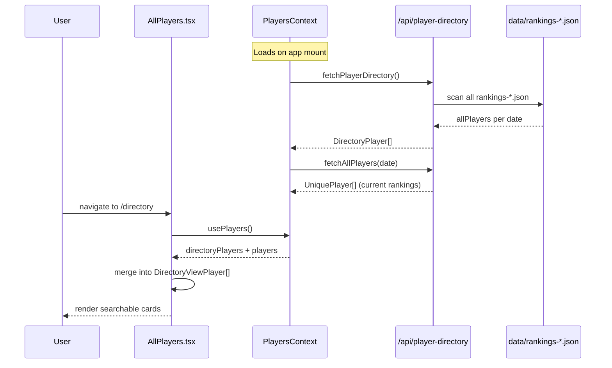

# Player Directory Page

**Route:** `/directory`
**Component:** `AllPlayers` (`src/pages/AllPlayers.tsx`, 334 lines)

## Purpose

The Player Directory is a searchable, browsable index of all junior badminton players who have appeared in any USAB rankings snapshot. Unlike the Rankings page (which shows one date's rankings), the directory aggregates player names across all historical ranking dates, making it possible to find players even if they are no longer actively ranked.

## Data Flow



## Data Sources

### PlayersContext (loaded on app mount)

- **`directoryPlayers: DirectoryPlayer[]`** -- from `GET /api/player-directory`. The server scans all `data/rankings-*.json` files and builds a cumulative player list with all known name variants, first/last name, location, and club.
- **`players: UniquePlayer[]`** -- from `GET /api/all-players?date=`. Current-date rankings with `PlayerEntry[]` per player (age group, event type, rank, points).

### Merge Logic

The page merges these two sources by `usabId`:

1. Start from `directoryPlayers` (superset of all players ever ranked).
2. For each player, attach their current `entries` from the `players` array (if they have any for the selected date).
3. Build `DirectoryViewPlayer` objects for rendering.

## Types

```typescript
// From src/types/junior.ts
interface DirectoryPlayer {
  usabId: string;
  name: string;
  names: string[];         // all name variants seen across dates
  firstName?: string;
  lastName?: string;
  location?: string;
  club?: string;
}

// Local to AllPlayers.tsx
interface DirectoryViewPlayer {
  usabId: string;
  name: string;
  names: string[];
  firstName?: string;
  lastName?: string;
  location?: string;
  club?: string;
  entries: PlayerEntry[];  // current ranking entries (may be empty)
}
```

## UI Features

### Search

Full-text search across player name, all name variants (`names[]`), and `usabId`. Case-insensitive substring match.

### Age Group Filter

Dropdown to filter players by age group (U11-U19). When active, only players with at least one `PlayerEntry` in that age group are shown. The filter also affects the displayed ranking entries on each card.

### Alphabetical Index

A-Z letter bar for quick navigation. Clicking a letter scrolls to the first player whose last name starts with that letter. The currently visible letter is highlighted based on scroll position.

### Player Cards

Each card shows:
- Player name (primary) and name variants (if different)
- Location and club (if available)
- Ranking entries as colored badges (age group color + rank + event type)
- Clicking a card navigates to `/directory/:usabId` (PlayerProfile)

## Navigation

- **From:** Dashboard feature card, Navbar "Players" link, Rankings table rows, tournament player detail "Player Profile" link
- **To:** `/directory/:usabId` (PlayerProfile) on card click
