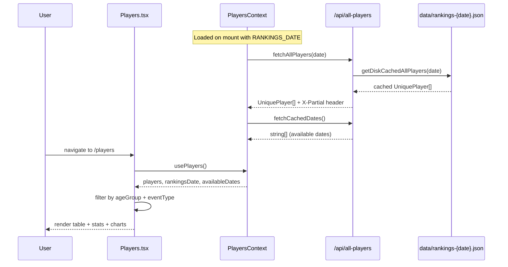

# Rankings Page

**Route:** `/players`
**Component:** `Rankings` (exported from `src/pages/Players.tsx`, 1068 lines)
**Navbar label:** "Rankings"

## Purpose

The Rankings page displays USAB junior badminton rankings organized by age group (U11-U19) and event type (BS/GS/BD/GD/XD). It supports historical date selection, provides aggregate statistics, and includes analytics visualizations.

## Data Flow



## Data Sources

### PlayersContext

- **`players: UniquePlayer[]`** -- all players for the selected date. Each player has `entries: PlayerEntry[]` containing their rank, points, age group, and event type across all categories they appear in.
- **`rankingsDate: string`** -- currently selected date (default: `RANKINGS_DATE` from `data/rankings-meta.json`).
- **`availableDates: string[]`** -- dates with cached ranking snapshots on disk.
- **`changeDate(date)`** -- invalidates the rankings cache and re-fetches for the new date.

### Default Date

`RANKINGS_DATE` is set at build time from `data/rankings-meta.json` (currently `"2026-03-01"`), imported via `src/data/usaJuniorData.ts`.

## Types

```typescript
// From src/types/junior.ts
type AgeGroup = 'U11' | 'U13' | 'U15' | 'U17' | 'U19';
type EventType = 'BS' | 'GS' | 'BD' | 'GD' | 'XD';

interface UniquePlayer {
  usabId: string;
  name: string;
  entries: PlayerEntry[];
}

interface PlayerEntry {
  ageGroup: AgeGroup;
  eventType: EventType;
  rank: number;
  rankingPoints: number;
}

// Local to Players.tsx
interface GroupStats {
  ageGroup: AgeGroup;
  eventType: EventType;
  count: number;
  topPlayer: string;
  avgPoints: number;
}

type ViewMode = 'rankings' | 'stats' | 'analytics';
```

## UI Structure

### Tab Navigation

Three view modes:

1. **Rankings** (default) -- sortable table of players for the selected age group and event type
2. **Player Stats** -- `StatCard` tiles showing top players, average points, and player counts per category
3. **Analytics** -- Recharts bar and area charts visualizing ranking distribution across age groups and events

### Age Group and Event Selectors

- Horizontal pill selectors for age group (U11-U19) and event type (BS/GS/BD/GD/XD).
- Styled with age-group-specific colors from `src/constants/ageGroupStyles.ts`.

### Date Picker

Dropdown of available historical dates. Changing the date triggers `PlayersContext.changeDate()` which invalidates the in-memory cache and refetches from the API.

### Rankings Table

- Columns: Rank, Name, Ranking Points
- Sorted by rank (ascending) within the selected age group + event type
- Each row links to `/directory/:usabId` (PlayerProfile)
- External link to `usabjrrankings.org` for the official source

### Player Stats Tab

Grid of `StatCard` components showing per-category breakdowns: player count, top-ranked player, average ranking points.

### Analytics Tab

Recharts visualizations:
- Bar charts comparing player counts across age groups
- Area charts showing points distribution

## Navigation

- **From:** Dashboard "Rankings" feature card, Navbar "Rankings" link
- **To:** `/directory/:usabId` (PlayerProfile) on table row click
- **External:** Links to `usabjrrankings.org/{usabId}/details` for official ranking detail
