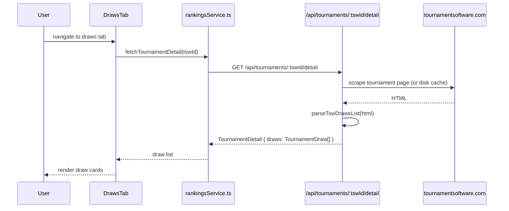
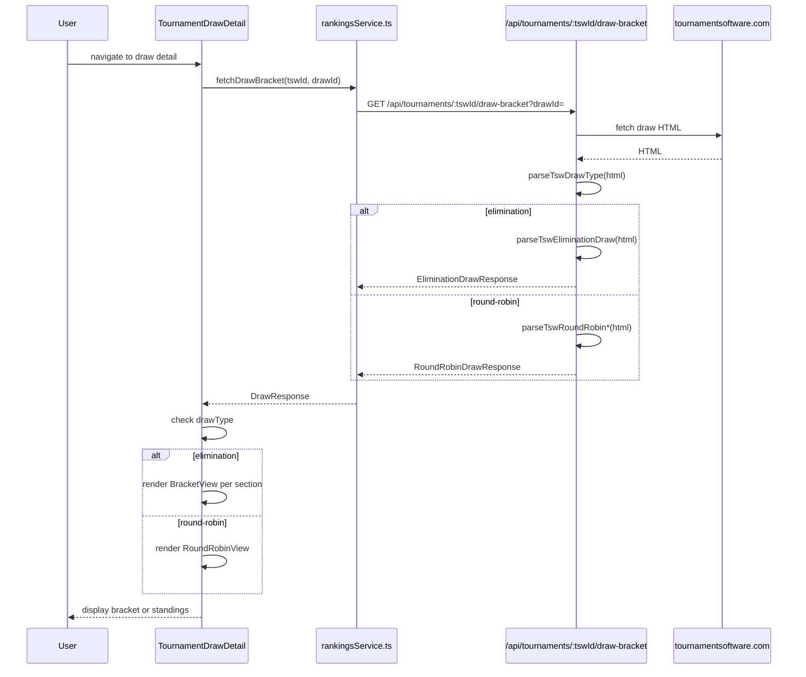
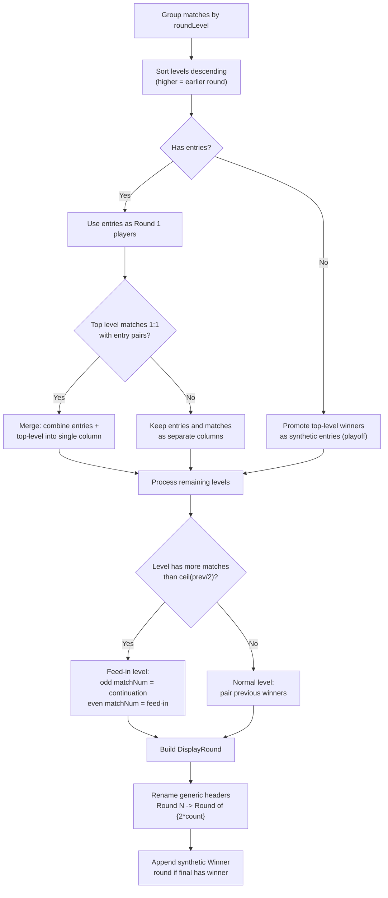

# Tournaments: Draws Page

## Draw List

**Route:** `/tournaments/:tswId/draws`
**Component:** `TournamentDrawsPage` -> `DrawsTab` (`src/components/tournament/tabs/DrawsTab.tsx`)

### Data Flow



### Types

```typescript
interface TournamentDraw {
  drawId: number;
  name: string;         // e.g., "U15 Boys Singles Main Draw"
  size: number | null;   // number of entries
  type: string | null;   // draw type label from TSW
  stage: string | null;
  consolation: string | null;
}
```

### UI

Cards for each draw showing name, size, type, and stage. Clicking a card navigates to `/tournaments/:tswId/draw/:drawId` with `state: { drawName, fromPath }`.

---

## Draw Detail Page

**Route:** `/tournaments/:tswId/draw/:drawId`
**Component:** `TournamentDrawDetail` (`src/pages/TournamentDrawDetail.tsx`)

### Data Flow



### Draw Type Detection

The server uses `parseTswDrawType(html)` which checks for the `DrawType__RR` CSS class in the HTML. If present, the draw is round-robin; otherwise, elimination.

### Response Types

```typescript
// Discriminated union
type DrawResponse = EliminationDrawResponse | RoundRobinDrawResponse;

interface EliminationDrawResponse {
  tswId: string;
  drawId: number;
  drawType: string;              // "elimination" or similar
  sections: BracketSection[];    // one per bracket (main, consolation, playoff)
}

interface RoundRobinDrawResponse {
  tswId: string;
  drawId: number;
  drawType: 'round-robin';
  groupName: string;
  groups: RoundRobinGroup[];
  standings: RoundRobinStanding[];
  matches: RoundRobinMatch[];
}
```

### Back Navigation

The detail page computes a smart back target:
1. Uses `fromPath` from React Router state (set by the draw list card)
2. Falls back to `getTournamentDrawOrigin(pathname)` from session storage
3. Defaults to `/tournaments/:tswId/draws`

---

## Elimination Bracket: How Draw Tables Are Organized

The elimination bracket rendering involves three stages: server-side HTML parsing, client-side data transformation, and client-side rendering.

### Stage 1: Server Parsing (`parseTswEliminationDraw`)

**File:** `api/_lib/shared.js`

TSW serves draw brackets as HTML tables. Each `<div class="draw"><table>` represents one bracket section (main draw, consolation, 3rd/4th playoff, etc.).

**Table structure:**

```
<div class="draw">
  <table>
    <caption>Main Draw</caption>
    <thead>
      <tr>
        <th>Round of 16</th>
        <th>Quarter-Finals</th>
        <th>Semi-Finals</th>
        <th>Final</th>
        <th>Winner</th>
      </tr>
    </thead>
    <tbody>
      <tr>
        <td class="entry">[1] Player Name (Club)</td>      <!-- seed + entry -->
        <td id="3001" class="match">Winner Name</td>       <!-- match cell -->
        <td>...</td>
      </tr>
      ...
    </tbody>
  </table>
</div>
```

**Parsing algorithm:**

1. **Split** HTML on `<div class="draw"><table>` to isolate each section
2. **Caption** -> section name (e.g., "Main Draw", "Consolation")
3. **`<thead>`** -> round name headers (skip optional "State" column)
4. **`<tbody>` rows**, cell by cell:
   - **Entry cells** (`class="entry"`): parse seed `[N]`, player name, club, partner (for doubles). Each entry gets a `position` (row index). "Bye" entries are flagged.
   - **Match cells** (`id="NNNN" class="match"`): the `id` attribute encodes the match identity:
     - `roundLevel` = all digits except last 3 (e.g., `3001` -> level 3)
     - `matchNum` = last 3 digits (e.g., `3001` -> match 1)
     - The cell text contains the winner's name (if decided)
   - **Score spans** (`<span class="score">`): parsed nearby match cells, format `"21-18"`. Retired/walkover flags detected from text content.
   - **Time patterns**: scheduled times matched to nearest match by row/column proximity -> `scheduledTime`

**Output per section:**

```typescript
interface BracketSection {
  name: string;           // "Main Draw", "Consolation", etc.
  rounds: string[];       // ["Round of 16", "Quarter-Finals", ...]
  entries: BracketEntry[];
  matches: BracketMatch[];
}

interface BracketEntry {
  position: number;       // row position in the bracket
  name: string;
  seed: string;
  club: string;
  playerId: number | null;
  partner?: string;       // for doubles
  bye: boolean;
}

interface BracketMatch {
  matchId: string;        // e.g., "3001"
  roundLevel: number;     // 3 = earlier round, 1 = final
  matchNum: number;       // position within the round
  winner: BracketPlayer | null;
  score: string[];        // game scores like ["21-18", "21-15"]
  retired: boolean;
  walkover: boolean;
  scheduledTime?: string;
}
```

### Stage 2: Client Transformation (`buildDisplayRounds`)

**File:** `src/components/tournament/BracketView.tsx`

This function transforms a raw `BracketSection` into `DisplayRound[]` suitable for left-to-right rendering.

**Algorithm:**



**Key concepts:**

- **Round levels descend**: TSW uses higher `roundLevel` for earlier rounds. Level 1 = final. The client reverses this for left-to-right display (earliest round on the left).

- **Two-column merge**: When the first match level has exactly as many unscored matches as entry pairs, the entries and first-round cells represent the same thing (TSW sometimes uses two columns for Round 1). These are merged into a single display column.

- **Feed-in detection**: A round level is a "feed-in" if it has more matches than `ceil(previousRoundMatchCount / 2)`. In feed-in levels:
  - **Odd `matchNum`** = continuation match (winner of previous round continues)
  - **Even `matchNum`** = feed-in match (new player enters the bracket from a qualifier or consolation)

- **Play-off sections**: Some sections (like 3rd/4th playoff) have no entries. In this case, winners from the top-level matches are promoted to synthetic entries.

**Output:**

```typescript
interface DisplayRound {
  name: string;
  matches: DisplayMatch[];
}

interface DisplayMatch {
  player1: DisplayPlayer | null;
  player2: DisplayPlayer | null;
  feedInPlayer?: DisplayPlayer;  // for feed-in rounds
  scores: string[];
  retired: boolean;
  walkover: boolean;
  scheduledTime?: string;
}

interface DisplayPlayer {
  name: string;
  seed: string;
  won: boolean;
  playerId: number | null;
  position?: number;      // original bracket position (round 1 only)
  partner?: string;
  partnerPlayerId?: number | null;
}
```

### Stage 3: Client Rendering (`BracketView`)

**File:** `src/components/tournament/BracketView.tsx`

**Layout:**

```
┌──────────────┐  ┌──────────────┐  ┌──────────────┐  ┌──────────────┐  ┌──────────┐
│  Round of 16 │  │ Quarter-Final│  │  Semi-Final   │  │    Final     │  │  Winner  │
├──────────────┤  ├──────────────┤  ├──────────────┤  ├──────────────┤  ├──────────┤
│ [1] Player A │  │              │  │              │  │              │  │          │
│     Player B │──┤  Player A    │  │              │  │              │  │          │
│              │  │  Player C    │──┤  Player A    │  │              │  │          │
│ [4] Player C │  │              │  │  Player F    │──┤  Player A    │  │ Player A │
│     Player D │──┤  Player C    │  │              │  │  Player G    │──┤  🏆      │
│              │  │              │  │              │  │              │  │          │
│ [3] Player E │  │              │  │              │  │              │  │          │
│     Player F │──┤  Player F    │  │              │  │              │  │          │
│              │  │  Player H    │──┤  Player F    │  │              │  │          │
│ [2] Player G │  │              │  │              │  │              │  │          │
│     Player H │──┤  Player G    │  │              │  │              │  │          │
│              │  │              │  │              │  │              │  │          │
└──────────────┘  └──────────────┘  └──────────────┘  └──────────────┘  └──────────┘
        ↕ connectors      ↕ connectors       ↕ connectors
```

**Rendering details:**

- **Horizontal scroll**: columns are laid out in a flex row with `overflow-x-auto`. Each round is a fixed-width column (`w-48`).
- **Sticky headers**: round names stick to the top during vertical scroll.
- **Match cards** (`BracketMatchCard`): show player 1 (top) and player 2 (bottom) with seed badges, winner highlighting, and score. Player names are links to `/tournaments/:tswId/player/:playerId`.
- **Entry positions**: the first column shows original bracket position numbers (1, 2, 3...) in a narrow column to the left of match cards.
- **Connectors**: CSS-based bracket lines between columns:
  - `BracketConnectors` -- tree-style connectors when the match count halves (standard elimination)
  - `BracketStraightConnectors` -- straight horizontal lines when match count stays equal (feed-in or playoff)
- **Feed-in alignment**: invisible `BracketFeedInEntry` placeholders maintain vertical alignment when feed-in matches appear.
- **Winner column**: special styling with trophy icon for the final winner.
- **Scroll persistence**: scroll position per bracket is cached in a module-level `_bracketScroll` Map keyed by `tswId:sectionName`, restored on re-render.

---

## Round-Robin View

**Component:** `RoundRobinView` (`src/components/tournament/RoundRobinView.tsx`)

### Data

```typescript
interface RoundRobinDrawResponse {
  tswId: string;
  drawId: number;
  drawType: 'round-robin';
  groupName: string;
  groups: RoundRobinGroup[];       // available groups to switch between
  standings: RoundRobinStanding[];
  matches: RoundRobinMatch[];
}

interface RoundRobinStanding {
  position: number;
  players: RoundRobinPlayer[];
  played: number;
  won: number;
  drawn: number;
  lost: number;
  matchRecord: string;     // e.g., "3-1"
  gameRecord: string;      // e.g., "7-3"
  pointRecord: string;     // e.g., "178-132"
  points: number;
  history: ('W' | 'L' | 'D')[];
}
```

### UI

- **Group switcher**: if multiple groups exist, buttons navigate to `/tournaments/:tswId/draw/:groupDrawId` for each group
- **Standings table**: full table with columns for Position, Player, Played, Won, Drawn, Lost, Match Record, Game Record, Point Record, Points, and a W/L/D history indicator (colored dots)
- **Match cards**: responsive grid of `RoundRobinMatchCard` components showing teams, scores, and outcome
- Player names link to `/tournaments/:tswId/player/:playerId`
