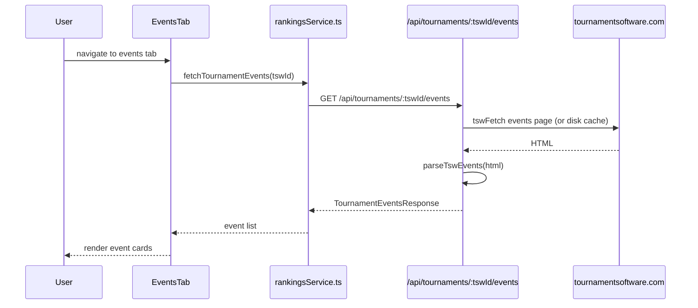

# Tournaments: Events Page

**Route:** `/tournaments/:tswId/events`
**Component:** `TournamentEventsPage` -> `EventsTab` (`src/components/tournament/tabs/EventsTab.tsx`)

## Purpose

Lists all events within a tournament (e.g., U15 Boys Singles, U17 Girls Doubles). Each event links to a detail page showing entries and associated draws.

## Data Flow



## Types

```typescript
interface TournamentEventsResponse {
  tswId: string;
  events: TournamentEvent[];
}

interface TournamentEvent {
  eventId: number;
  name: string;       // e.g., "U15 Boys Singles"
  draws: number;      // number of draws in this event
  entries: number;     // number of entries
}
```

## UI Features

- **Event cards**: show event name, number of draws, and number of entries
- **Color coding**: events are colored by age group using `getEventColor(eventName)`
- **Navigation**: clicking an event navigates to `/tournaments/:tswId/event/:eventId`

---

## Event Detail Page

**Route:** `/tournaments/:tswId/event/:eventId`
**Component:** `TournamentEventDetail` (`src/pages/TournamentEventDetail.tsx`)

### Data Source

**Endpoint:** `GET /api/tournaments/:tswId/event-detail?eventId=`

### Types

```typescript
interface TournamentEventDetailResponse {
  tswId: string;
  eventId: number;
  eventName: string;
  entriesCount: number | null;
  draws: TournamentEventDetailDraw[];
  entries: TournamentEventDetailEntry[];
}

interface TournamentEventDetailDraw {
  drawId: number;
  name: string;
  size: number | null;
  type: string | null;
  qualification: string | null;
  consolation: string | null;
}

interface TournamentEventDetailEntry {
  entryType: string;
  seed: string | null;
  players: TournamentEventEntryPlayer[];
}

interface TournamentEventEntryPlayer {
  name: string;
  playerId: number;
}
```

### UI Features

- **Draws section**: list of draws for this event, each linking to `/tournaments/:tswId/draw/:drawId`
- **Entries section**: list of all entries with seed (if seeded) and player names (linked to player detail)
- **Entry count**: total entries displayed in header
