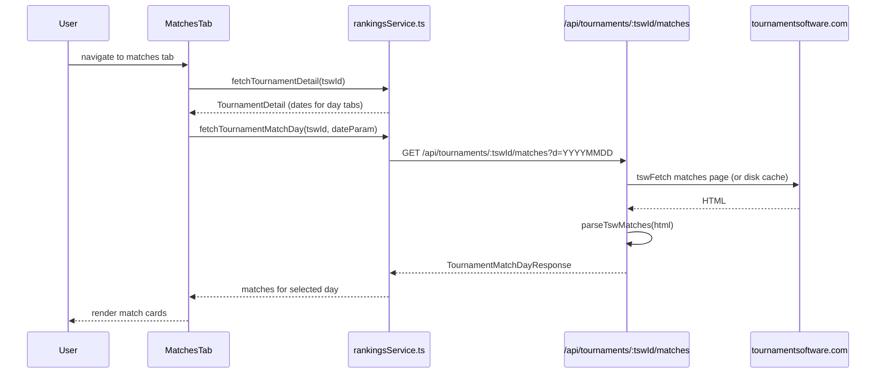

# Tournaments: Matches Page

**Route:** `/tournaments/:tswId/matches`
**Component:** `TournamentMatchesPage` -> `MatchesTab` (`src/components/tournament/tabs/MatchesTab.tsx`)

## Purpose

Displays all matches for a tournament organized by day. Users can browse through each day's matches, see scores, courts, times, and match status.

## Data Flow



## Types

```typescript
interface TournamentMatchDayResponse {
  tswId: string;
  date: string;
  matches: TournamentMatch[];
}

interface TournamentMatch {
  event: string;           // e.g., "U15 Boys Singles"
  round: string;           // e.g., "Quarter-Finals"
  header: string;          // combined event + round display text
  team1: string[];         // player names
  team2: string[];
  team1Ids?: (number | null)[];
  team2Ids?: (number | null)[];
  team1Won: boolean;
  team2Won: boolean;
  scores: number[][];      // [[21,18], [21,15]]
  bye?: boolean;
  walkover?: boolean;
  retired?: boolean;
  time: string;            // scheduled time
  court: string;
  duration: string;
  location: string;
  status?: string;         // "upcoming", "in-progress", "completed"
}
```

## UI Features

### Day Tabs

A horizontal tab bar showing each tournament day (derived from tournament start/end dates). Each tab triggers a fetch for that day's matches using the `YYYYMMDD` date parameter.

### Match Cards

Each match is rendered using the shared `MatchCard` component:
- Event name and round header
- Team 1 vs Team 2 with player names (linked to `/tournaments/:tswId/player/:playerId`)
- Score display (game-by-game)
- Time, court, and duration
- Status badges: walkover, retired, bye
- Winner highlighting

### Snapshot Persistence

`MatchesTab` uses `MatchesTabSnapshot` to persist the selected day tab across React Router navigations (stored in a module-level variable), so the user returns to the same day when navigating back.

### Refresh

Refresh button re-fetches with `refresh=true` to bypass server-side cache and get live data from TSW.
