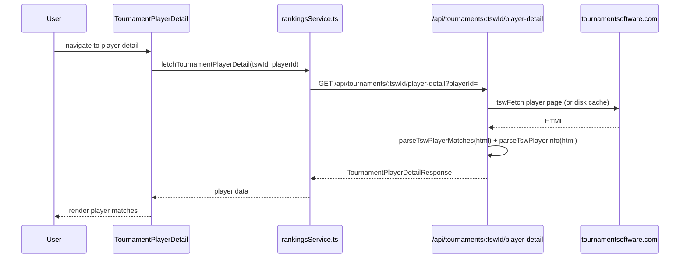

# Tournaments: Player Detail Page

**Route:** `/tournaments/:tswId/player/:playerId`
**Component:** `TournamentPlayerDetail` (`src/pages/TournamentPlayerDetail.tsx`, 192 lines)

## Purpose

Shows a single player's matches, events, and win/loss record within a specific tournament. Serves as the bridge between tournament data (TSW) and player profiles (USAB rankings).

## Data Flow



## Data Source

**Endpoint:** `GET /api/tournaments/:tswId/player-detail?playerId=`

The server scrapes the TSW player page within the tournament context and returns:

```typescript
interface TournamentPlayerDetailResponse {
  tswId: string;
  playerId: number;
  playerName: string;
  memberId?: string;       // USAB member ID (enables cross-link to directory)
  club: string;
  events: string[];        // events the player is entered in
  winLoss: TournamentPlayerWinLoss | null;
  matches: TournamentMatch[];
  hasUpcomingMatches?: boolean;
}

interface TournamentPlayerWinLoss {
  wins: number;
  losses: number;
  total: number;
  winPct: number;
}
```

## UI Sections

### Player Header

- Player name and club
- Win/loss summary badge (e.g., "5W - 2L (71%)")
- Events list as colored badges

### Player Profile Link

If `memberId` is present in the response (the player's USAB member ID was found on their TSW profile), a "Player Profile" link is shown pointing to `/directory/:memberId`. This cross-links tournament data back to the USAB rankings-based profile.

### Schedule Link

When `hasUpcomingMatches` is true, the page shows a Calendar icon linking to `/tournaments/:tswId/player/:playerId/schedule`. The schedule page predicts upcoming opponents by walking the bracket. See [Player Profile Page - Schedule Link](player-profile-page.md#schedule-link) for implementation details.

### Match List

All tournament matches rendered as `MatchCard` components:
- Event name and round
- Opponent team with player name links
- Score display
- Walkover/retired/bye badges
- Winner highlighting

## Cross-Linking

```mermaid
graph LR
    TournPlayers["/tournaments/:tswId/players<br/>PlayersTab"] -->|click player| TPD["/tournaments/:tswId/player/:playerId<br/>TournamentPlayerDetail"]
    MatchCards["Match cards<br/>(any tournament page)"] -->|click player name| TPD
    TPD -->|"Player Profile" link<br/>(if memberId exists)| Profile["/directory/:memberId<br/>PlayerProfile"]
    Profile -->|tournament match card link| TPD
```

## Navigation

### Back Button

Uses `fromPath` from React Router state or falls back to `/tournaments/:tswId/players`. The back target adapts to where the user came from:
- From player list -> back to player list
- From match card on matches page -> back to matches page
- From draw bracket -> back to draw bracket

### Coming From

This page can be reached from:
- Tournament players list (PlayersTab)
- Any match card player name link (MatchesTab, DrawDetail, etc.)
- Player profile tournament match cards (PlayerProfile)
- Watchlist tab player links
