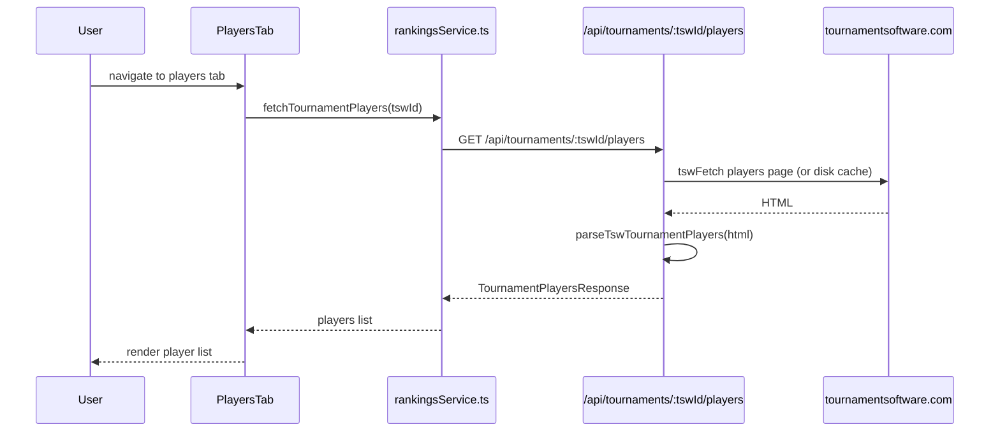

# Tournaments: Players Page

**Route:** `/tournaments/:tswId/players`
**Component:** `TournamentPlayersPage` -> `PlayersTab` (`src/components/tournament/tabs/PlayersTab.tsx`)

## Purpose

Lists all players registered for a specific tournament. Provides search and links to each player's tournament-specific match record.

## Data Flow



## Types

```typescript
interface TournamentPlayersResponse {
  tswId: string;
  players: TournamentPlayer[];
}

interface TournamentPlayer {
  playerId: number;    // TSW player ID
  name: string;
  club: string;
}
```

## UI Features

- **Search**: filter players by name (case-insensitive substring)
- **Player list**: each row shows player name and club
- **Navigation**: clicking a player navigates to `/tournaments/:tswId/player/:playerId`
- **Watchlist integration**: players can be added to the tournament watchlist via `WatchlistContext`
