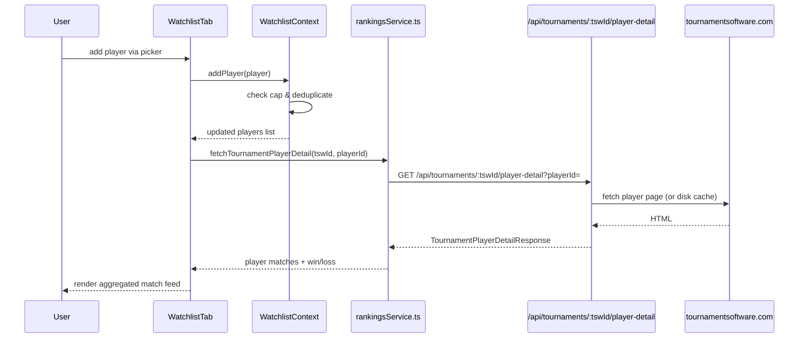
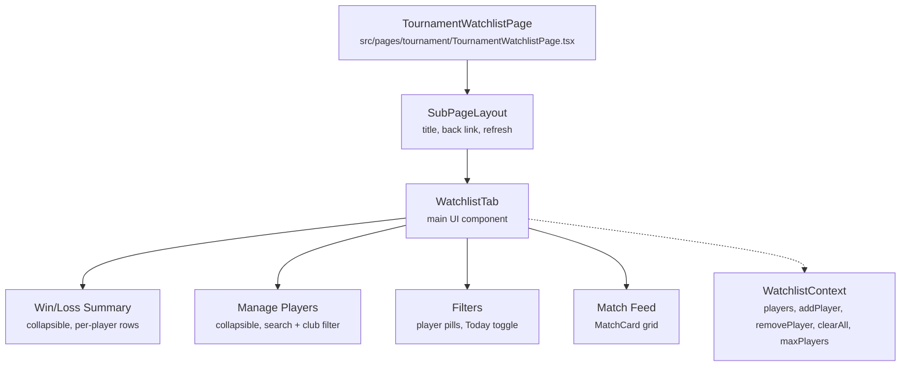

# Tournaments: Watchlist

**Route:** `/tournaments/:tswId/watchlist`
**Components:** `TournamentWatchlistPage` -> `WatchlistTab` (`src/components/tournament/tabs/WatchlistTab.tsx`)
**Context:** `WatchlistContext` (`src/contexts/WatchlistContext.tsx`)

## Purpose

The Watchlist lets users track selected players during a tournament. It aggregates each player's matches into a single feed with win/loss summaries, "Now Playing" highlighting, and per-player or "Today" filtering. Designed for parents and coaches following multiple players at a live event.

## Visibility

The Watchlist link on the Tournament Hub is only shown when **all** conditions are met:

1. **Tournament Focus Mode** is active for this tournament (`isFocusedTournament`).
2. **Date eligibility** — the tournament starts within 2 days from today, or is currently ongoing (i.e. `startDate <= today + 2 days` AND `endDate >= today`).

The `?debug` URL parameter bypasses the date check (see [URL Parameters](#url-parameters)).

## Player Cap

| Scenario | Max Players |
|----------|-------------|
| Default (no URL params) | **7** |
| `?watchlist_max=N` | N (any positive integer) |

When the cap is reached:
- The "Manage Players" header shows `(7/7 full)` in amber.
- The search input is disabled with placeholder "Watchlist full (7 max)".
- Individual player "Add" buttons show "Full" and are disabled.
- The "Add all" button is hidden.

When adding players in bulk ("Add all"), only the first N players up to the remaining capacity are added.

## Data Flow

## Component Structure

## State Management

### Global (WatchlistContext)

The `WatchlistProvider` wraps the entire app. It stores watched players in a `Map<number, TournamentPlayer>` keyed by `playerId`.

- **Tournament binding:** The watchlist auto-clears when the user switches to a different focused tournament.
- **Player cap:** `addPlayer` silently rejects additions when `playerMap.size >= WATCHLIST_MAX`.
- **Persistence:** In-memory only; cleared on page refresh.

### Local (WatchlistTab)

| State | Default | Persisted? |
|-------|---------|------------|
| `summaryOpen` | `true` | Yes (sessionStorage per tournament) |
| `pickerOpen` | `true` | Yes (sessionStorage per tournament) |
| `playerFilter` | `null` | Yes (sessionStorage per tournament) |
| `todayOnly` | depends on dates | Yes (sessionStorage per tournament) |
| `searchQuery` | `''` | No |
| `clubFilter` | `''` | No |
| `dropdownOpen` | `false` | No |

Collapsible section states and filter selections are persisted to `sessionStorage` under key `watchlist-ui-${tswId}` so they survive navigation to player detail and back. This also ensures scroll position restores correctly (via the global `useScrollRestore` hook) since the page layout matches what was saved.

## UI Sections

### 1. Win/Loss Summary (collapsible)

- Shows an "Overall" row when multiple players are watched (total wins, losses, win%).
- Per-player rows with initials avatar, name, W-L record, and win% bar.
- Clicking a player row toggles it as the active `playerFilter`.

### 2. Manage Players (collapsible)

- Search input with auto-dropdown of tournament players (filtered by search + club).
- Club filter pills inside the dropdown.
- "Add all N players" / "Add N more players" bulk-add button (respects cap).
- Watched player chips with individual remove (X) and "Clear all" action.
- Input and add buttons are disabled when at capacity.

### 3. Filters

- **Player pills:** Filter the match feed to a single player's matches (or "All").
- **Today toggle:** Show only matches from today (only shown when tournament date range includes today).

### 4. Match Feed

- Deduped, sorted by time (most recent first), with "Now Playing" matches pinned to top.
- Uses `MatchCard` component with `fromPath` for back-navigation.
- Internal matches (both teams have watched players) are annotated.

## URL Parameters

Read once at module load time; persist for the entire SPA session.

| Parameter | Where Used | Effect |
|-----------|------------|--------|
| `?debug` | `TournamentHub.tsx` | Bypasses the date eligibility check — watchlist link always appears in tournament focus mode |
| `?watchlist_max=N` | `WatchlistContext.tsx` | Overrides the default player cap of 7 |

These two parameters are independent. Examples:

- `http://localhost:5173?debug` — watchlist visible for any tournament, cap is 7
- `http://localhost:5173?watchlist_max=25` — cap is 25, date restriction still applies
- `http://localhost:5173?debug&watchlist_max=25` — both overrides active

## Key Files

| File | Role |
|------|------|
| `src/contexts/WatchlistContext.tsx` | Global state: player map, add/remove/clear, cap enforcement |
| `src/components/tournament/tabs/WatchlistTab.tsx` | Main UI: picker, summary, filters, match feed |
| `src/pages/tournament/TournamentWatchlistPage.tsx` | Page wrapper with SubPageLayout and refresh |
| `src/pages/TournamentHub.tsx` | Visibility gate: date eligibility + debug override |
| `src/components/tournament/MatchCard.tsx` | Shared match card used in the feed |
