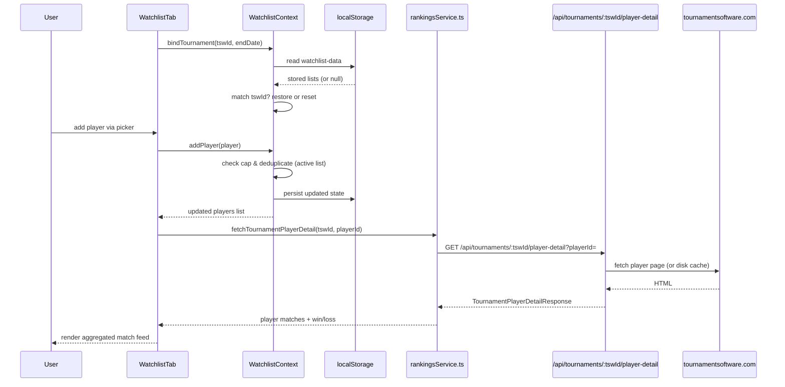
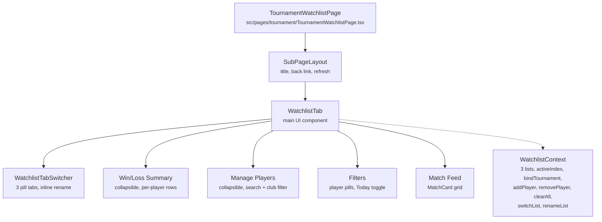

# Tournaments: Watchlist

**Route:** `/tournaments/:tswId/watchlist`
**Components:** `TournamentWatchlistPage` -> `WatchlistTab` (`src/components/tournament/tabs/WatchlistTab.tsx`)
**Context:** `WatchlistContext` (`src/contexts/WatchlistContext.tsx`)

## Purpose

The Watchlist lets users track selected players during a tournament. It aggregates each player's matches into a single feed with win/loss summaries, "Now Playing" highlighting, and per-player or "Today" filtering. Designed for parents and coaches following multiple players at a live event.

## Visibility

The Watchlist link on the Tournament Hub is only shown when **all** conditions are met:

1. **Tournament Focus Mode** is active for this tournament (`isFocusedTournament`).
2. **Date eligibility** — the tournament starts within 2 days from today, or is currently ongoing (i.e. `startDate <= today + 2 days` AND `endDate >= today`).

The `?watchlist_enable` URL parameter bypasses the date check (see [URL Parameters](#url-parameters)).

## Multiple Watchlists

Each tournament supports **3 named watchlists**. Users can:

- Switch between lists via pill-shaped tabs at the top of the watchlist page.
- Rename any list by tapping the pencil icon on the active tab (inline edit, 20-char max).
- Default names are "Watchlist 1", "Watchlist 2", "Watchlist 3".
- A player can appear in any number of lists — no cross-list uniqueness constraint.

## Player Cap

The cap applies **per list independently** (so up to 7 × 3 = 21 total unique players).

| Scenario | Max Players Per List |
|----------|----------------------|
| Default (no URL params) | **7** |
| `?watchlist_max=N` | N (any positive integer) |

When the cap is reached on the active list:
- The "Manage Players" header shows `(7/7 full)` in amber.
- The search input is disabled with placeholder "Watchlist full (7 max)".
- Individual player "Add" buttons show "Full" and are disabled.
- The "Add all" button is hidden.

When adding players in bulk ("Add all"), only the first N players up to the remaining capacity are added.

## Persistence

### localStorage (player lists)

All 3 watchlists, the active list index, and the bound tournament ID are stored in `localStorage` under key `watchlist-data`. The schema:

```typescript
interface WatchlistStorage {
  tswId: string;
  tournamentEndDate: string;   // e.g. "2026-03-28"
  activeIndex: number;         // 0 | 1 | 2
  lists: [WatchlistEntry, WatchlistEntry, WatchlistEntry];
}

interface WatchlistEntry {
  name: string;
  players: TournamentPlayer[]; // { playerId, name, club }
}
```

This means:
- Watchlists survive page refresh, app kill, and browser restart.
- On reopen, the user lands on the same active list they were last viewing.
- Only **one tournament** is stored at a time (see [Tournament Scoping](#tournament-scoping)).

### sessionStorage (UI state)

Collapsible section states and filter selections are persisted to `sessionStorage` under key `watchlist-ui-${tswId}-${activeIndex}` (per tournament, per list). This survives navigation to player detail and back within a session.

| State | Default | Persisted? |
|-------|---------|------------|
| `summaryOpen` | `true` | Yes (sessionStorage per tournament per list) |
| `pickerOpen` | `true` | Yes (sessionStorage per tournament per list) |
| `playerFilter` | `null` | Yes (sessionStorage per tournament per list) |
| `todayOnly` | depends on dates | Yes (sessionStorage per tournament per list) |
| `searchQuery` | `''` | No |
| `clubFilter` | `''` | No |
| `dropdownOpen` | `false` | No |

## Tournament Scoping

Only one tournament's watchlist data lives in `localStorage` at a time:

- When the user opens the watchlist page, `WatchlistTab` calls `bindTournament(tswId, endDate)` on the context.
- If the stored `tswId` matches, the saved lists are restored — no data loss.
- If the stored `tswId` differs (or no data exists), all 3 lists are reset and the new tournament is bound.
- Navigating to a different tournament's non-watchlist pages (matches, players, etc.) does **not** clear the stored watchlist.

## localStorage TTL / Cleanup

The stored data includes `tournamentEndDate`. On **provider mount** (app startup), the context checks:

- If `tournamentEndDate` is set and `today > endDate + 7 days`, the `watchlist-data` key is deleted.
- This means data **auto-expires 7 days** after the tournament ends.
- If no `endDate` exists, data is kept until overwritten by a different tournament's watchlist.

## Data Flow



## Component Structure



## UI Sections

### 0. Watchlist Tab Switcher

- 3 pill-shaped tabs in a horizontal row at the top, styled consistently with the existing filter pills (violet active, slate inactive).
- Each tab shows: list name + player count badge (e.g. "My Kids (3)").
- Tap an inactive tab to switch lists (`switchList(index)`).
- Small pencil icon on the active tab for inline rename (Enter/blur to confirm, Escape to cancel).
- Switching lists resets local match data and re-fetches for the new list's players.

### 1. Win/Loss Summary (collapsible)

- Shows an "Overall" row when multiple players are watched (total wins, losses, win%).
- Per-player rows with initials avatar, name, W-L record, and win% bar.
- Clicking a player row toggles it as the active `playerFilter`.

### 2. Manage Players (collapsible)

- Search input with auto-dropdown of tournament players (filtered by search + club).
- Club filter pills inside the dropdown.
- "Add all N players" / "Add N more players" bulk-add button (respects cap).
- Watched player chips with individual remove (X) and "Clear all" action.
- Input and add buttons are disabled when at capacity.

### 3. Filters

- **Player pills:** Filter the match feed to a single player's matches (or "All").
- **Today toggle:** Show only matches from today (only shown when tournament date range includes today).

### 4. Match Feed

- Deduped, sorted by time (most recent first), with "Now Playing" matches pinned to top.
- Uses `MatchCard` component with `fromPath` for back-navigation.
- Internal matches (both teams have watched players) are annotated.

## URL Parameters

Parsed once at app startup in `src/utils/urlFlags.ts` (eagerly loaded), so they are captured before lazy-loaded pages change the URL.

| Parameter | Where Defined | Where Consumed | Effect |
|-----------|---------------|----------------|--------|
| `?watchlist_enable` | `urlFlags.ts` | `TournamentHub.tsx` | Bypasses the date eligibility check — watchlist link always appears in tournament focus mode |
| `?watchlist_max=N` | `urlFlags.ts` | `WatchlistContext.tsx` | Overrides the default player cap of 7 (per list) |

The two parameters are independent. Examples:

- `http://localhost:5173?watchlist_enable` — watchlist visible for any tournament, cap is 7/list
- `http://localhost:5173?watchlist_max=25` — cap is 25/list, date restriction still applies
- `http://localhost:5173?watchlist_enable&watchlist_max=25` — both overrides active

## Key Files

| File | Role |
|------|------|
| `src/utils/urlFlags.ts` | Eagerly-loaded URL parameter capture (`watchlist_enable`, `watchlist_max`) |
| `src/contexts/WatchlistContext.tsx` | Multi-list state, localStorage persistence, tournament binding, add/remove/clear/switch/rename |
| `src/components/tournament/tabs/WatchlistTab.tsx` | Main UI: tab switcher, picker, summary, filters, match feed |
| `src/pages/tournament/TournamentWatchlistPage.tsx` | Page wrapper with SubPageLayout and refresh |
| `src/pages/TournamentHub.tsx` | Visibility gate: date eligibility + watchlist_enable override |
| `src/components/tournament/MatchCard.tsx` | Shared match card used in the feed |
