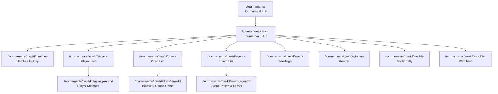
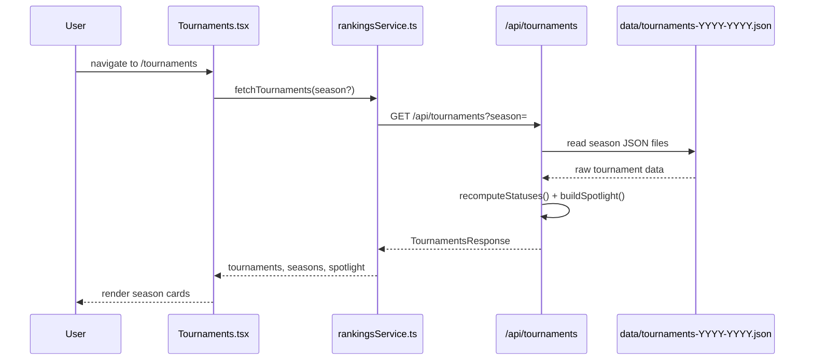

# Tournaments

The Tournaments feature provides a comprehensive view of USAB junior badminton tournaments, from the season schedule down to individual draw brackets and match results. It consists of a tournament list page, a per-tournament hub, and multiple sub-pages.

## Page Hierarchy



## Sub-Page Documents

- [Draws Page](tournaments-draws.md) -- draw list, elimination bracket algorithm, round-robin view
- [Matches Page](tournaments-matches.md) -- match schedule by day
- [Tournament Players Page](tournaments-players.md) -- player list within a tournament
- [Events Page](tournaments-events.md) -- event list and event detail
- [Seeds, Winners, Medals Pages](tournaments-seeds-winners-medals.md) -- seedings, results, medal tally
- [Tournament Player Detail](tournaments-player-detail.md) -- individual player matches within a tournament
- [Watchlist](tournaments-watchlist.md) -- track players, aggregated match feed, win/loss summary

---

## Tournament List Page

**Route:** `/tournaments`
**Component:** `Tournaments` (`src/pages/Tournaments.tsx`, ~424 lines)

### Data Flow



### Data Source

**Endpoint:** `GET /api/tournaments?season=YYYY-YYYY`

The server reads `data/tournaments-YYYY-YYYY.json` files (created by `scripts/refresh-tournaments-cache.mjs`) and:
1. Recomputes each tournament's `status` (upcoming / in-progress / completed) based on dates and current time
2. Selects a `spotlight` tournament (the current or next in-progress/upcoming one)
3. Returns available seasons for the season picker

### Types

```typescript
interface ScheduledTournament {
  name: string;
  startDate: string | null;
  endDate: string | null;
  region: TournamentRegion | string;   // NW, NE, NorCal, SoCal, MW, South, National
  hostClub: string;
  type: TournamentType | string;       // ORC, OLC, CRC, National, Selection, JDT
  tswId: string | null;
  tswUrl: string | null;
  usabUrl: string | null;
  prospectusUrl: string | null;
  status: TournamentStatus;            // upcoming, in-progress, completed
}

interface TournamentsResponse {
  season?: string;
  tournaments?: ScheduledTournament[];
  seasons?: Record<string, TournamentSeasonData>;
  availableSeasons: string[];
  spotlight?: ScheduledTournament | null;
}
```

### UI Features

- **Season picker** -- dropdown of available seasons (e.g., "2025-2026")
- **Spotlight banner** -- highlights the in-progress or next upcoming tournament with a prominent card
- **Filters** -- region badges and tournament type pills (ORC, OLC, CRC, National, Selection)
- **Status filter** -- upcoming / in-progress / completed toggle
- **Month grouping** -- tournaments grouped by month within the selected season
- **Tournament cards** -- show name, dates, location, region badge, type badge, status icon, and links to:
  - Tournament hub (if `tswId` available)
  - TSW external page
  - USAB page
  - Prospectus PDF

---

## Tournament Hub Page

**Route:** `/tournaments/:tswId`
**Component:** `TournamentHub` (`src/pages/TournamentHub.tsx`, ~193 lines)

### Purpose

The hub is the landing page for a specific tournament. It displays tournament metadata and provides navigation pills to all sub-pages.

### Data Source

Uses `useTournamentMeta(tswId)` hook which:
1. Checks React Router `location.state` for tournament name/dates/location (passed from the tournament list)
2. If missing, calls `fetchTournaments()` and finds the matching tournament by `tswId`
3. Falls back to `fetchTournamentDetail(tswId)` for TSW-sourced metadata

### Section Pills

Defined as the single source of truth in `SECTIONS`:

| Pill | Route | Icon |
|------|-------|------|
| Matches | `/tournaments/:tswId/matches` | Swords |
| Players | `/tournaments/:tswId/players` | Users |
| Draws | `/tournaments/:tswId/draws` | List |
| Events | `/tournaments/:tswId/events` | CalendarDays |
| Seeds | `/tournaments/:tswId/seeds` | Bookmark |
| Winners | `/tournaments/:tswId/winners` | Trophy |
| Medals | `/tournaments/:tswId/medals` | Medal |

### Legacy Redirect

For backward compatibility, `?tab=X` query parameters redirect to `/tournaments/:tswId/X`.

### External Links

- Link to TSW tournament page: `https://www.tournamentsoftware.com/tournament/{tswId}`

---

## Tournament Focus Mode

### Purpose

Tournament Focus Mode locks the app's navigation to a specific tournament, replacing the standard Navbar items with tournament-specific navigation. This provides an immersive experience during live tournament viewing.

### Implementation

**Context:** `TournamentFocusContext` (`src/contexts/TournamentFocusContext.tsx`)

State:
- `activeTswId: string | null` -- the focused tournament's TSW ID
- `isActive: boolean` -- whether focus mode is on
- `isTransitioning: boolean` -- brief animation state during mode toggle

Persistence: `sessionStorage` (key: `tournament-focus-tswId`). Focus mode survives page refreshes but not new tabs.

### Activation / Deactivation

- **Enter:** User clicks the tournament mode toggle button on the Tournament Hub. `enterMode(tswId)` sets `activeTswId` in context and sessionStorage.
- **Exit (manual):** User clicks the toggle again. `exitMode()` clears state and navigates to `/`.
- **Exit (auto):** `TournamentFocusAutoExit` component monitors `pathname` on every navigation. If the user navigates outside the tournament scope, focus mode auto-exits. Scope is determined by `isWithinTournamentFocusScope()` which checks:
  - Path starts with `/tournaments/{activeTswId}/`
  - Path is a player profile linked from within the tournament (`fromPath` state)
  - Path matches the last remembered tournament path

### Navbar Behavior

When focus mode is active, `Navbar` replaces standard nav items with tournament-specific items from `getTournamentFocusNavItems(tswId)` in `src/utils/tournamentFocus.ts`:
- Matches, Players, Draws (direct links to tournament sub-pages)
- Back to Hub (tournament home)

### Visual Indicator

`TournamentModeTransitionLayer` renders a full-screen overlay with a brief purple tint animation when toggling mode.

---

## Shared Tournament UI

### SubPageLayout

`src/components/tournament/SubPageLayout.tsx` provides consistent chrome for all tournament sub-pages:
- Back button to the hub
- Tournament name as title
- Optional refresh button
- Passes `tswId` to child components

### Tab Helpers

`src/components/tournament/shared.tsx` provides:
- `TabLoading`, `TabError`, `TabEmpty` -- loading/error/empty state components
- `RefreshButton` -- refresh data from TSW (bypasses cache)
- `useTabData(fetcher, tswId)` -- generic hook for tab data fetching with loading/error state
- `getEventColor(eventName)` -- color mapping for age-group-based event styling

### Tournament Cache Detection

When `rankingsService.ts` receives a response with `X-Source: cache` header from a tournament API endpoint, it records that `tswId` in a module-level `Set`. This allows UI components to know whether tournament data came from pre-scraped cache or live TSW fetching (affects refresh button behavior and staleness indicators).
