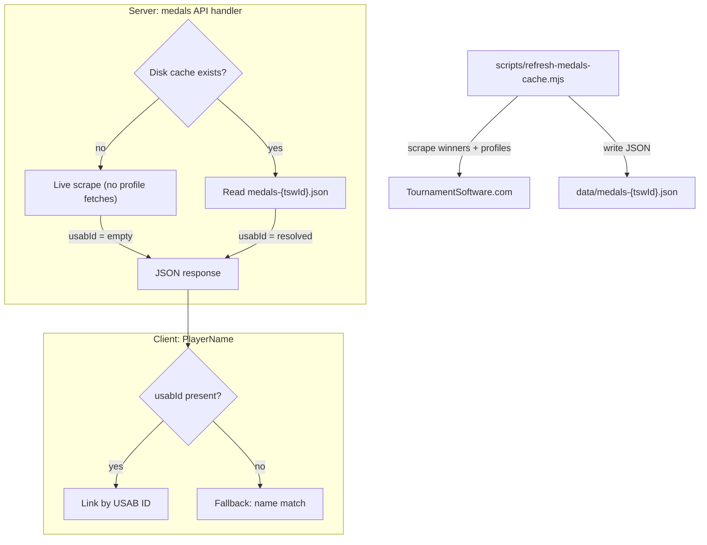

# Medals System — Architecture Design Document

## Overview

The Medals system displays tournament medal results (gold, silver, bronze) for USA Badminton junior tournaments. It scrapes data from TournamentSoftware.com, resolves player USAB IDs, and presents a club-level medal tally with per-event drill-down.

## Architecture



## Components

### 1. Pre-scrape Script — `scripts/refresh-medals-cache.mjs`

Runs offline (manually or via CI) to scrape tournament results and resolve USAB IDs.

| Aspect | Detail |
|---|---|
| **Input** | `<tswId>` args, `--season <year>`, or `--all` (reads `data/tournaments-*.json`) |
| **Skip logic** | Skips if `data/medals-{tswId}.json` already exists (override with `--force`) |
| **TSW requests** | 1 winners page + 1 players POST + ~N player profile GETs (5 concurrent) |
| **Output** | `data/medals-{tswId}.json` containing `{ tswId, tournamentName, medals }` |
| **Runtime** | ~40s per tournament (dominated by profile page fetches) |

### 2. Shared Disk Cache Helpers — `api/_lib/shared.js`

| Function | Purpose |
|---|---|
| `loadMedalsDiskCache(tswId)` | Reads `data/medals-{tswId}.json`, returns parsed JSON or `null` |
| `saveMedalsDiskCache(tswId, data)` | Writes JSON to disk (used by script only) |

### 3. API Handler — `api/tournaments/[tswId]/medals.js`

Three-tier caching strategy, each returning progressively less-enriched data:

| Tier | Source | USAB IDs? | Latency | Header |
|---|---|---|---|---|
| 1. In-memory cache | `getCached()` / `setCache()` (10-min TTL) | Depends on original source | ~0ms | `X-Cache: HIT` |
| 2. Disk cache | `data/medals-{tswId}.json` | Yes (resolved by script) | ~5ms | `X-Cache: DISK` |
| 3. Live scrape | TSW winners + players pages | No (`usabId = ''`) | ~3-5s | `X-Cache: MISS` |

**Key functions in the handler:**

| Function | Purpose |
|---|---|
| `getAgeGroup(eventName)` | Extracts age group (e.g. `U13`) from draw name |
| `getEventType(eventName)` | Extracts event type (`BS`, `GS`, `BD`, `GD`, `XD`) from draw name |
| `normalizePlaces(results)` | Maps raw place strings (`1`, `1/2`, `2`, `3/4`, etc.) to gold/silver/bronze/fourth arrays |
| `buildClubStats(medals)` | Aggregates per-club medal counts, sorted by total then gold |
| `enrichPlayers(entries, pMap)` | Maps TSW player IDs to `{ name, club, usabId }` (live path: `usabId = ''`) |
| `enrichBronze(entries, pMap)` | Same as above but preserves team grouping (array of arrays) |
| `fetchTournamentPlayers(tswId)` | Fetches the tournament players list from TSW |

### 4. Client Service — `src/services/rankingsService.ts`

```typescript
fetchTournamentMedals(tswId: string): Promise<TournamentMedals>
```

- Client-side `Map` cache (avoids re-fetching within a session)
- 120s fetch timeout
- Returns `TournamentMedals` to the UI

### 5. Client UI — `src/pages/TournamentDetail.tsx`

- Renders a **club medal tally table** (gold / silver / bronze / total columns)
- Each row expands to show per-event detail with player names
- **Player linking:** Uses `PlayerName` component that checks `usabId` first, falls back to name-based matching against the global players context

### 6. Local Dev Server — `api-server.mjs`

Routes `GET /api/tournaments/:tswId/medals` to the handler via dynamic import.

## Data Types — `src/types/junior.ts`

```typescript
interface MedalPlayer {
  name: string;
  club: string;
  usabId?: string;
}

interface DrawMedals {
  drawName: string;   // e.g. "BS U13"
  ageGroup: string;   // e.g. "U13"
  eventType: string;  // e.g. "BS"
  gold: MedalPlayer[];
  silver: MedalPlayer[];
  bronze: MedalPlayer[][];   // array of teams (each team is a player array)
  fourth: MedalPlayer[][];
}

interface ClubMedalSummary {
  club: string;
  gold: number;
  silver: number;
  bronze: number;
  total: number;
}

interface TournamentMedals {
  tswId: string;
  tournamentName: string;
  clubs: ClubMedalSummary[];
  medals: DrawMedals[];
}
```

## Disk Cache File Format

Each `data/medals-{tswId}.json` stores a JSON object matching the `TournamentMedals` shape (without `clubs` — those are computed at serve time by `buildClubStats`):

```json
{
  "tswId": "A7A8ADBC-267C-4A11-AB5F-65CF7135CEEC",
  "tournamentName": "2025 SoCal Junior Open",
  "medals": [
    {
      "drawName": "BS U13",
      "gold": [{ "name": "Player A", "club": "Club X", "usabId": "12345" }],
      "silver": [{ "name": "Player B", "club": "Club Y", "usabId": "67890" }],
      "bronze": [[{ "name": "Player C", "club": "Club Z", "usabId": "11111" }]],
      "fourth": []
    }
  ]
}
```

## External Dependencies

| Service | Endpoints Used |
|---|---|
| TournamentSoftware.com | `GET /sport/winners.aspx?id={tswId}` — event winners |
| | `POST /tournament/{tswId}/Players/GetPlayersContent` — player list with clubs |
| | `GET /sport/player.aspx?id={tswId}&player={playerId}` — individual profile (USAB ID) |

All TSW requests go through the `tswFetch()` helper which handles base URL, headers, and error handling.
